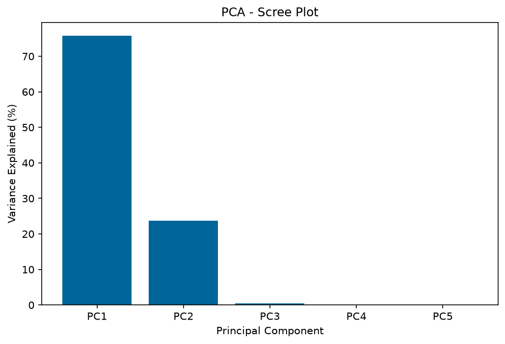
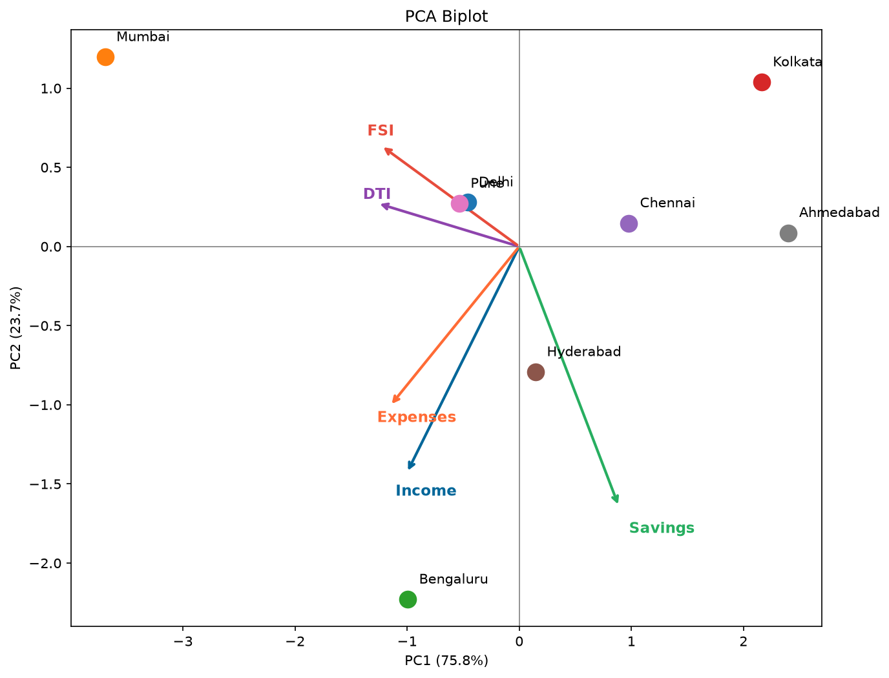
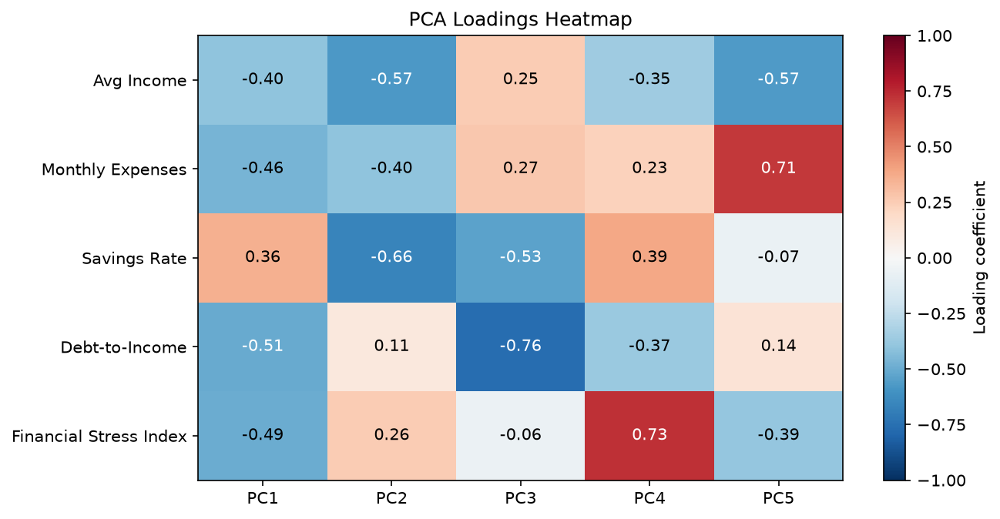

# PCA-Financial-Analysis


Five financial indicators across 8 Indian cities — income, expenses, savings rate, debt-to-income, and a financial stress index — turn out to be almost the same number wearing different units. This project shows that, and quantifies it.

---

## 🔍 The Question

Income, expenses, debt-to-income, and financial stress are usually treated as separate things to track. But are they actually independent, or is a city that earns more also spending more, borrowing more, and stressed more — just one underlying pattern measured five different ways?

---

## 📂 Dataset

8 major Indian cities × 5 financial indicators (2023–24), sourced from Statista (city-wise average salaries) and CNBC (EMI-to-income ratios):

| City | Avg Income (₹/mo) | Expenses (₹/mo) | Savings Rate (%) | Debt-to-Income (%) | Financial Stress Index |
|---|---|---|---|---|---|
| Delhi | 55,000 | 41,000 | 18 | 36 | 52 |
| Mumbai | 62,000 | 51,000 | 12 | 55 | 71 |
| Bengaluru | 72,000 | 52,000 | 24 | 38 | 48 |
| Kolkata | 38,000 | 27,000 | 20 | 26 | 40 |
| Chennai | 48,000 | 35,000 | 21 | 32 | 44 |
| Hyderabad | 58,000 | 42,000 | 22 | 34 | 46 |
| Pune | 54,000 | 40,000 | 19 | 40 | 53 |
| Ahmedabad | 42,000 | 30,000 | 23 | 23 | 38 |

---

## 🧮 What the Data Says

Computing the correlation matrix first answers the question directly: Income and Expenses move together at **r = 0.97**. Debt-to-Income and Financial Stress Index move together at **r = 0.98**. Almost nothing here is independent.

That's confirmed by the PCA result — one single axis (PC1) absorbs **75.75%** of all variance across the 5 variables, and a second axis picks up nearly everything else (**23.69%**). Two numbers per city replace five, losing almost no information.

| Component | Eigenvalue | % Variance | Cumulative % |
|---|---|---|---|
| PC1 | 3.7877 | 75.75% | 75.75% |
| PC2 | 1.1846 | 23.69% | 99.45% |
| PC3–PC5 | 0.0277 | 0.55% | 100.00% |

---

## 🧭 What PC1 Actually Is

It's not an abstract math construct — its loadings spell out a recognisable axis:

| Variable | Loading |
|---|---|
| Income | −0.40 |
| Expenses | −0.46 |
| Debt-to-Income | −0.51 |
| Financial Stress Index | −0.49 |
| Savings Rate | +0.36 |

Four variables pulling one way, Savings Rate pulling the other. PC1 is a **cost-of-living-and-debt-burden score**, derived rather than assumed:

| City | PC1 Score | Reading |
|---|---|---|
| Mumbai | −3.69 | Highest income, highest debt burden, lowest relative savings |
| Bengaluru | −0.99 | Moderately high pressure |
| Kolkata | +2.16 | Low cost, comparatively strong savings |
| Ahmedabad | +2.40 | Lowest cost, lowest debt burden |

**PC2** picks up what PC1 misses: Bengaluru is the one outlier (PC2 = −2.23) — high income *and* the highest savings rate in the dataset (24%), a profile distinct from every other city.

---

## ⚙️ Pipeline

`pca_analysis.py` implements PCA from the ground up, then checks it against `scikit-learn`:

| Step | What it does |
|---|---|
| 1️⃣ Standardise | Z-score normalisation (ddof=1, matches Excel's `STDEV.S`) |
| 2️⃣ Covariance Matrix | Measures co-movement between all variable pairs |
| 3️⃣ Eigendecomposition | `np.linalg.eigh` → eigenvalues + eigenvectors |
| 4️⃣ Sort | Descending order by variance explained |
| 5️⃣ Project | Standardised data × sorted eigenvectors → PCA scores |
| 6️⃣ Validate | Cross-check every number against `sklearn.decomposition.PCA` |

No step is hidden behind a library call until step 6 — the manual implementation is the actual analysis; sklearn is there to prove it's correct, not to replace it.

---

## 📈 Visuals

### Scree Plot

*Two components, not five — the scree plot is the visual version of the correlation argument above.*

### Biplot

*Arrows show how each variable pulls; dots show where each city actually lands. Mumbai and Ahmedabad sit at opposite ends of the same axis.*

### Loadings Heatmap

*Full loading matrix — confirms PC3 onward carry almost no signal (near-zero coefficients).*

---

## 🚀 Run It

```bash
pip install -r requirements.txt
python pca_analysis.py
```

---


## 🗂️ Project Structure

\```
PCA_Financial_Analysis/
├── pca_analysis.py        # Main analysis script
├── README.md              # Project documentation
├── requirements.txt       # Dependencies
├── scree_plot.png         # Variance explained per component
├── biplot.png             # City positions & variable loadings
└── loadings_heatmap.png   # Full loading matrix
\```

---
## ⚠️ Limitation

The dataset covers 8 major Indian cities, sized to balance genuinely sourced, city-level financial data (Statista, CNBC) against the limited public availability of consistent metrics at this granularity. A larger sample would strengthen statistical generalization, but at the cost of relying on estimated rather than sourced figures for additional cities.

---

**Yashika Dutt** 
